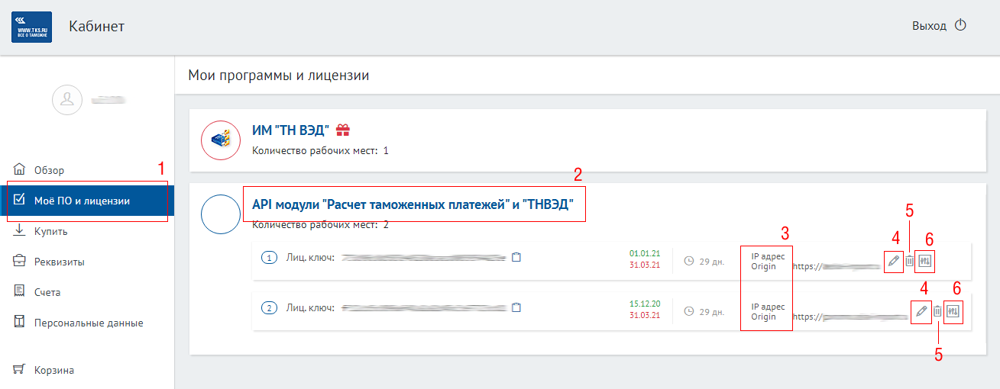

# Документация по работе с Личным кабинетом MY.TKS.RU

Личный кабинет ТКС (далее - ЛК) предназначен для пользователей программных продуктов ТКС и содержит такую информацию, как перечень оплаченных рабочих мест (с возможностью конфигурации продукта, если таковая поддерживается продуктом), перечень "подарочных" продуктов, список выставленных счетов, прайс-лист и т.п.

## Адрес ЛК

ЛК доступен по адресу https://my.tks.ru/

## Разделы ЛК

Представлены следующие разделы:

- **[Обзор](https://my.tks.ru/profile/)** - общая информация об ЛК
- **[Моё ПО и лицензии](https://my.tks.ru/acct/products/)** - список оплаченных и подарочных рабочих мест ПО
- **[Купить](https://my.tks.ru/products/)** - перечень ПО с ценами (прайс-лист) с возможностью оформить заказ
- **[Реквизиты](https://my.tks.ru/acct/firm/)** - реквизиты юридического или физического лица (для договора)
- **[Счета](https://my.tks.ru/acct/bills/)** - выставленные счета
- **[Персональные данные](https://my.tks.ru/profile/view/)** - Ф.И.О. пользователя
- **[Корзина](https://my.tks.ru/products/cart/)** - корзина для формирования заказа, ПО добавляется в разделе "Купить"

## Доступ к ЛК

Учётная запись ЛК может быть создана пользователем самостоятельно на [странице регистрации](https://my.tks.ru/profile/signup/). Также учётная запись может быть создана автоматически, при выставлении счёта на ПО. В этом случае поля раздела "Реквизиты" блокируются и не подлежат редактированию пользователем.

## Лицензионные ключи

Для регистрации конкретного экземпляра ПО на конкретном рабочем месте используется механизм Лицензионных ключей. Лицензионные ключи представляют собой 32-знаковые идентификаторы, состоящие из цифр и букв английского алфавита в нижнем регистре (*[a-z0-9]{32}*), их можно получить в разделе ["Моё ПО и лицензии"](https://my.tks.ru/acct/products/) в разворачивающейся секции, соответствующей регистрируемому ПО.

## Сертификаты

Для доступа к [API ТКС](https://github.com/tkssoft/api.tks.ru-docs) могут использоваться как Лицензионные ключи, так и сертификаты стандарта *X.509*. 

В частности, [библиотека доступа к сервисам tks.ru](https://github.com/tkssoft/api.tks.ru) использует файл в формате *JavaScript*, содержащий в себе сертификат и несколько переменных. Такой файл генерируется обращением по следующему адресу:

    https://my.tks.ru/products/lic/js/<лицензионный ключ>.js

где 

**<лицензионный ключ>** - ключ в формате *[a-z0-9]{32}*, соответствующий приобретенному рабочему месту клиента (размещён в ЛК)

Результатом выполнения запроса является файл в формате *JavaScript*, который можно включить следующим образом:

    

В файле присутствуют следующие константы:

* _const calc_tks_ru_license_ - текст сертификата стандарта *X.509*
* _const ccs_cert_notafter_ - дата, до которой действует сертификат
* _const ccs_cert_origin_ - Origin клиента, указанный в настройках расчёта в ЛК
* _const ccs_cert_error_ - текст ошибки либо пустая строка
* _const client_id_ - ключ в формате *[a-z0-9]{32}*, соответствующий приобретенному рабочему месту клиента (размещён в ЛК)

## Валидация лицензионного ключа (проверка доступа к API)

ЛК позволяет валидировать лицензионный ключ для модулей API. Для этого используется запрос вида:

        https://my.tks.ru/products/lic/validate/?ip=<ip адрес>&code=<лицензионный ключ>&origin=<origin>&module=<имя модуля>

где 

**<лицензионный ключ>** - ключ в формате *[a-z0-9]{32}*, соответствующий приобретенному рабочему месту клиента (размещён в ЛК)

**<ip адрес>** - IP-адрес клиента, указанный в настройках расчёта в ЛК

**&lt;origin&gt;** - Origin клиента, указанный в настройках расчёта в ЛК

**<имя модуля>** - наименование модуля API (API.TNVED, API.TREE, API.CALC и т.п.)

Результат выполнения запроса для случая, если доступ с указанными данными к запрошенному модулю API разрешён:

    HTTP 200
    {"status": "ACTIVE"}

Результат выполнения запроса для случая, если доступ запрещён:

    HTTP 403

## Настройки API ТКС

Программные продукты категории [API ТКС](https://github.com/tkssoft/api.tks.ru-docs) предусматривают настройки, осуществляемые непосредственно в ЛК. 

### Расчёт контракта

Описание API Расчёт контракта находится [здесь](https://github.com/tkssoft/api.tks.ru#%D1%80%D0%B0%D1%81%D1%87%D0%B5%D1%82-%D0%BA%D0%BE%D0%BD%D1%82%D1%80%D0%B0%D0%BA%D1%82%D0%B0).

Настройки разделены на две группы:

- IP адрес / Origin
- Дополнительная логика расчёта

**IP адрес / Origin** используется для контроля доступа к API. В случае использования API на сайте указывается домен (включая префикс протокола http\[s\]), на котором размещён калькулятор. В случае использования API во внутренней системе - IP адрес, с которого производится обращение к API.

Эти настойки находятся в правой части (3) подраздела "API модули 'Расчет таможенных платежей' и 'ТНВЭД'" (2) раздела "Моё ПО и лицензии" (1) Личного кабинета MY.TKS.RU. Вызов окна редактирования этих настроек осуществляется нажатием на иконку с изображением карандаша (4). Удалить IP адрес / Origin можно при помощи иконки с изображением мусорного бака (5).

**Дополнительная логика расчёта**

Настройки дополнительной логики расчёта уникальны для IP адреса / Origin и вызываются нажатием на иконку с изображением пульта с ползунками (6).

Страница настроек представлена на скриншоте ниже.

1. IP адрес / Origin, для которого производится настройка.
2. Наименование набора настроек.
3. Группа кнопок для управления всеми наборами настроек (слева направо): добавление набора настроек, загрузка набора настроек, сохранение набора настроек, справка.
4. Группа кнопок для управления конкретнум набором настроек (слева направо): копирование набора настроек, удаление набора настроек, активация/деактивация набора настроек.

Набор настроек "разворачивается" нажатием на наименование этого набора и представляет собой таблицу.

Описание столбцов:

- **ID типа** - автоматически заполняемое поле, идентификатор текущего набора настроек
- **Наименование типа расчёта 1** - первая составляющая наименования набора настроек
- **Наименование типа расчёта 2** - вторая составляющая наименования
- **Наименование типа расчёта 3** - третья составляющая наименования
- **Наименование строки** - наименование компонента набора настроек
- **Составляющая** - наименование составляющей компоненты
- **Условие** - условие, при котором строка участвует в расчёте
- **Формула** - формула, по которой производится расчёт строки
- **Переменная** - имя переменной, в которую записывается результат расчёта строки (для использования в формулах в последующих строках)
- **Порядок** - порядковый номер строки
- **Столбец операций со строками** - добавление новой строки, активация строки, сохранение редактирования ячейки, удаление строки

При расчёте происходит последовательное вычисление значений для ккаждой из строк в порядке возрастания значения поля "Порядок" в соответствие с формулой (поле "Формула"). В случаях, когда строка неактивна или если условие (поле "Условие") ложно, расчёт строки не производится. Для строк с одинаковым значением поля "Наименование строки" происходит суммирование результатов расчёта каждой из строк.

Список обозначений, используемых в столбцах "Условие" и "Формула", периодически дополняется. Текущий список можно увидеть в выпадающем блоке при нажатии кнопки "Помощь".

